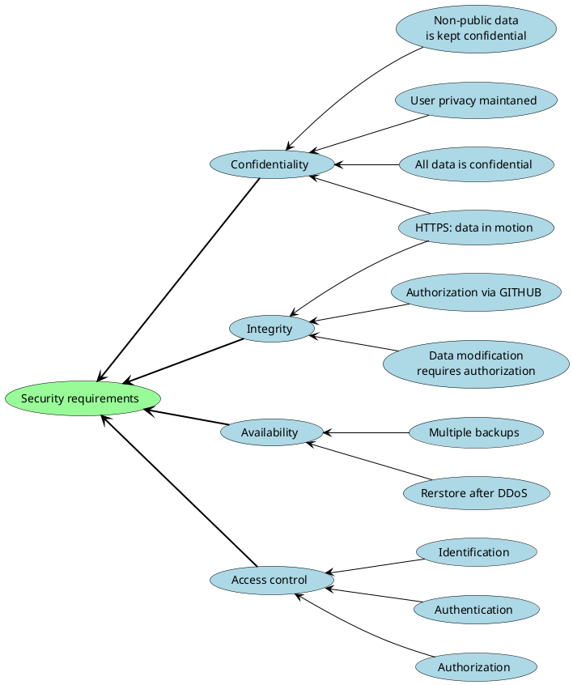
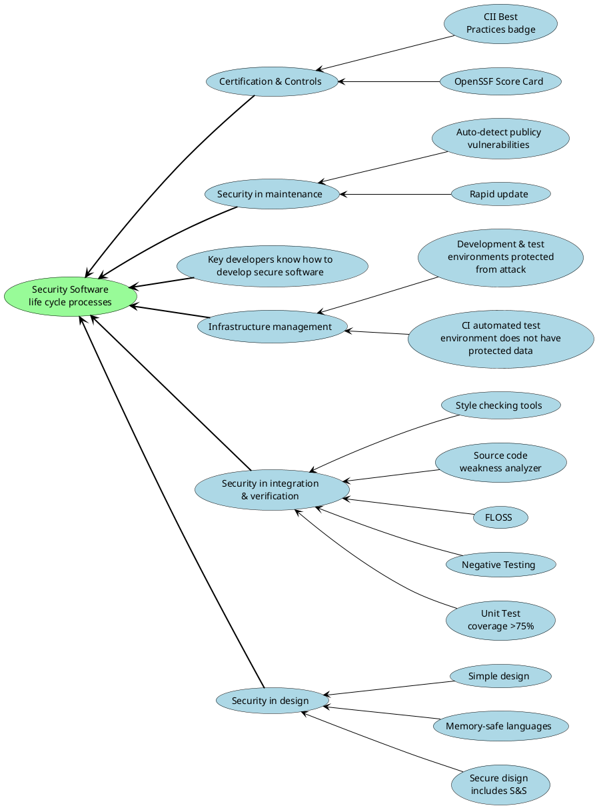

# Security policy

### Contents
1. [Introduction](#1-introduction)
2. [Vulnerabilities](#2-vulnerabilities)  
    2.1 [Supported Versions](#21-supported-versions)  
    2.2 [Vulnerability Report](#22-vulnerability-report)  
    2.3 [Security Disclosure](#23-security-disclosure)  
3. [Security requrements](#3-security_requirements)
4. [Security Software life cycle processes](#3-security-software-life-cycle-processes)

---

## 1. Introduction

This document describes the sequence of actions when the vulnerability is founded, the product version that fixes them, security requirements, as well as the required process of developing a secure code.
 
 > To view the Items 3 & 4, you need to install a `plantuml` extension for your browser.

---

## 2. Vulnerabilities

### 2.1 Supported Versions

We are releasing patches to eliminate vulnerabilities, you can see below:

| Version     | Supported by | Edge-Orchestration | 3-rd party component                           |
| ----------- | ------------ | ------------------ | ---------------------------------------------- |
| 1.0.0       | N/A          |                    |                                                |
| 1.1.0       | Fixed        |                    | CVE-2020-15257, CVE-2021-32760, CVE-2021-41103 |
| 1.1.1       | Fixed        |                    | CVE-2021-41190                                 |
| 1.1.4       | Fixed        | CVE-2006-4624      |                                                |
| 1.1.6       | Fixed        | CVE-2006-4624      |                                                |
| 1.1.8       | Fixed        |                    | CWE-843                                        |
| 1.1.9       | Fixed        |                    | CVE-2022-23648                                 |
| 1.1.11      | Fixed        |                    | CVE-2021-3121                                  |

### 2.2 Vulnerability Report

The Edge-Orchestration team assigns the highest priority to all security bugs in Edge-Orchestration project. We appreciate your efforts and
responsible disclosure of information to eliminate vulnerabilities.

Please report security bugs by emailing the Security Issue Review (SIR) team at: homeedge-security-issues@lists.lfedge.org marked "SECURITY".
Our team will confirm your request and within 1 week will try to prepare recommendations for elimination. Our team will keep you updated on the progress towards the fix until the full announcement of the patch release. During this process, the edge-orchestration team may request additional information or guidance.

### 2.3 Security Disclosure

When a security group receives a security error report as previously mentioned, it is assigned the highest priority and the person in charge. This person will coordinate the patch and release process,
including the following steps:

  * Confirm the problem and identify the affected versions.
  * Check the code to find any similar problems.
  * Prepare fixes for all releases still in maintenance. These fixes will
    released as quickly as possible.

We suggest the following format when disclosing vulnerabilities:

  * Your name and email.
  * Include scope of vulnerability. Let us know who could use this exploit.
  * Document steps to identify the vulnerability. It is important that we can reproduce your findings. 
  * How to exploit vulnerability, give us an attack scenario.

---

## 3. Security requrements

---

## 4. Security Software life cycle processes

---
