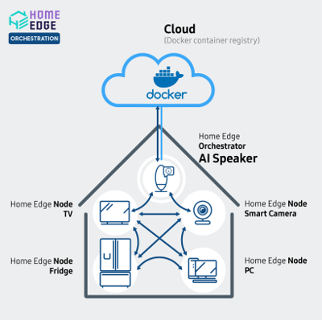
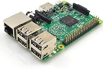
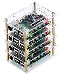
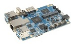
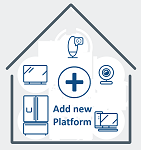

# Edge Orchestration

## Introduction
The main purpose of **Edge Orchestration project** is to implement distributed computing between Docker Container enabled devices. 

All the devices (TVs, fridges, washing machines, etc.) connected into *Home Edge Network* are considered *Home Edge Devices*. Some of the devices, possessing significant H/W resources and capable of running containerized applications, are called *Home Edge Nodes*. Tasks performed on devices of *Home Edge Network* are managed by *Home Edge Orchestrator* software. These tasks are called *Home Edge Applications*. They are assigned to specific *Home Edge Nodes*. As of now, *Home Edge Orchestrator* incessantly scans the *Home Edge Network*, forming lists of attached devices, and forms ratings of performance for them. Performance ratings are basis for deciding on which devices *Home Edge Applications* are to be run. If *Home Edge Orchestrator* cannot find device with rating higher than its own device rating, it will start the *Home Edge Application* locally. *Home Edge Networks* support distributed applications consisting of interacting Docker container instances. Docker containers offer quick deployment, easy management, safety and hardware independence. Applications that can run on *Home Edge Network* are deployed from cloud-based centralized storage as needed. Assortment of applications is determined by tasks that must be solved by *Home Edge Network*.

> A description of all terms and abbreviations (*italic*) used in the Edge Orchestratiopn project can be found in the [Home Edge Glossary](docs/home_edge_glossary.md)

---
## Roadmap and Release Notes
You can see our project roadmap and details about release notes since our project launch in 2019 from [our official Wiki](https://wiki.lfedge.org/display/HOME/Roadmap+and+Release+Notes).

## Platforms supported

| **x86-64 Linux** | **Raspberry Pi3** | **HiKey960** | **Raspberry Pi3 Cluster** |
|------------------|-------------------|--------------|---------------------------|
||||||
| **Orange Pi3** | **Add a new Platform** |||
|||||

---

## Quick start of the Edge Orchestration (w/ and w/o build)

#### Prerequisites
  - At least one device (see [Platforms supported](#platforms-supported)) that can be a *Home Edge Device* (preferably more than one) 
  - Same network connected among the *Home Edge Devices*.
  - Same Authentication key in /var/edge-orchestration/user/orchestration_userID.txt
  - Edge Orchestration Docker image
> The quick start guide contains instructions on where to find Edge Orchestration Docker image and how to create Authentication key 

### The Edge Orchestration workflow is as follows:

0. Run the Edge Orchestration container at *Home Edge Nodes*.
1. *Home Edge Device* generates and sends a Service Execution request via the REST API to a host machine (currently itself).
2. Then the host machine becomes an *Home Edge Orchestrator*. 
3. Other *Home Edge Nodes* receive the Service Execution request from *Home Edge Orchestrator* via REST API.
4. The *Home Edge Node* gets and compares the **scores** from the other *Home Edge Nodes*.
5. The Service Execution on the *Home Edge Node* that has the highest score.
> *Home Edge Orchestrator* also gets and compares **scores** and if it has the highest score, the service is executed on *Home Edge Orchestrator*.

### Quick start guides for supported platforms

Please select the target platform in the table below and follow the link.

| Platform                | Maintained  | Maintainer   | Remarks                           |
|-------------------------|-------------|--------------| ----------------------------------|
| [x86_64 Linux]          | dewberries  | @lf-edge/edge-home-orchestration-go-committers | |
| [Raspberry Pi3]         | dewberries  | @t25kim      |                                   |
| [HiKey960]              | dewberries  | @tdrozdovsky |                                   |
| [Raspberry Pi3 Cluster] | dewberries  | @tdrozdovsky |                                   |
| [Orange Pi3]            | dewberries  | @Vitalii55   |                                   |
---

## Documentation
The Edge Orchestration documentation for the project is located in the [docs] folder.
You can also familiarize yourself with other materials and plans by visiting the [wiki](https://wiki.lfedge.org/display/HOME/Home+Edge+Project). 

---

## License
The Edge Orchestration source code is distributed under the [Apache License, Version 2.0](https://opensource.org/licenses/Apache-2.0) open source license.

---

## Contributing
If you want to contribute to the Edge Orchestration project and make it better, your help is
very welcome. Contributing is also a great way to learn more about social
coding on Github, new technologies and and their ecosystems.  
[How to contribute code](.github/CONTRIBUTING.md)  
[How to report a security vulnerability](.github/SECURITY.md)

---

[docs]: ./docs
[x86_64 Linux]: docs/platforms/x86_64_linux/x86_64_linux.md
[Raspberry Pi3]: docs/platforms/raspberry_pi3/raspberry_pi3.md
[HiKey960]: docs/platforms/hikey960/hikey960.md
[Raspberry Pi3 Cluster]: docs/platforms/raspberry_pi3_cluster/raspberry_pi3_cluster.md
[Orange Pi3]: docs/platforms/orange_pi3/orange_pi3.md
