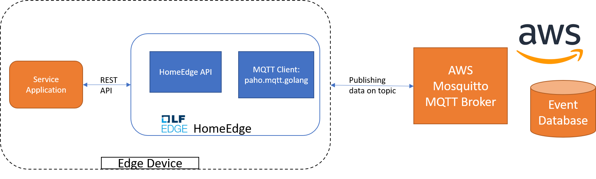
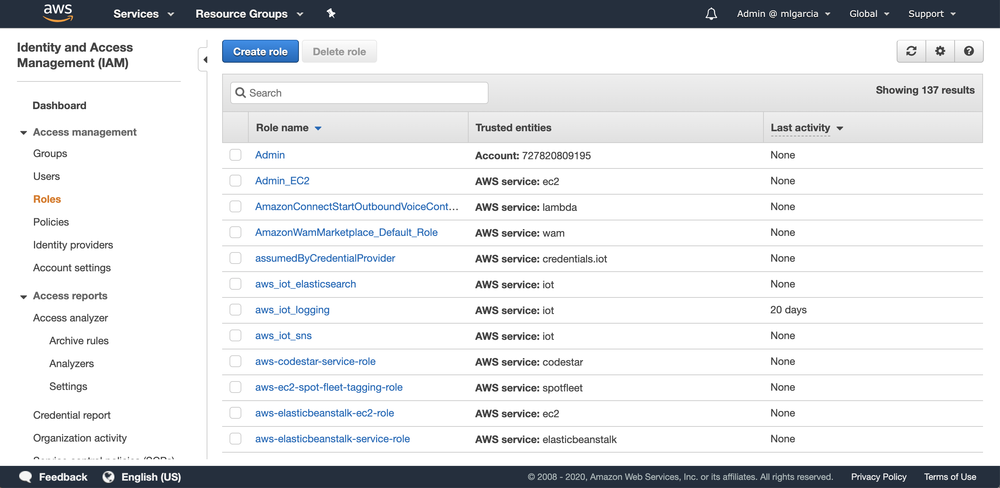
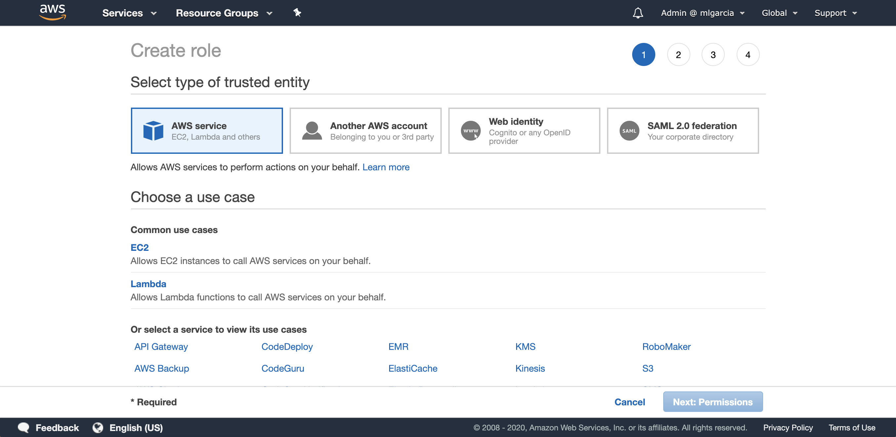
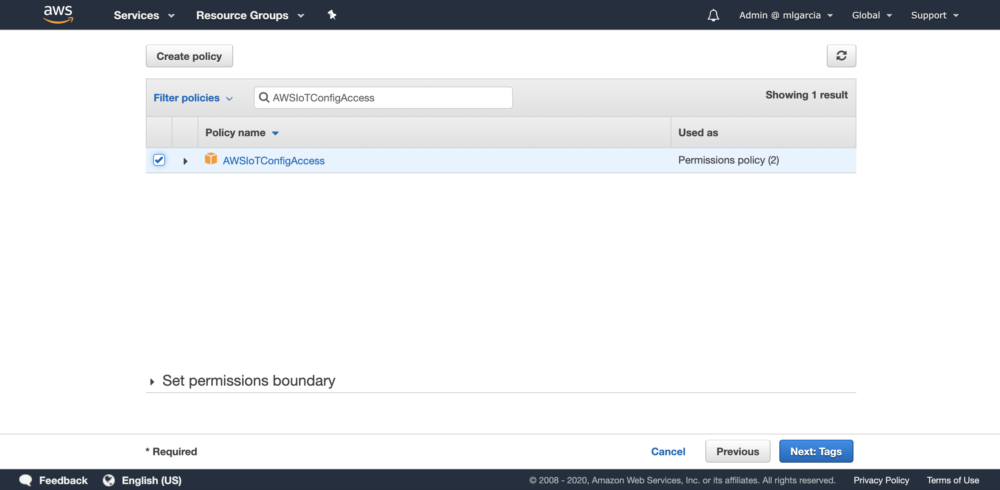
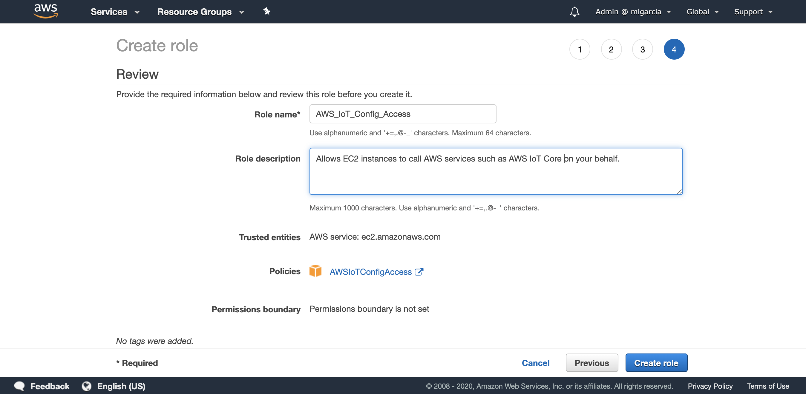
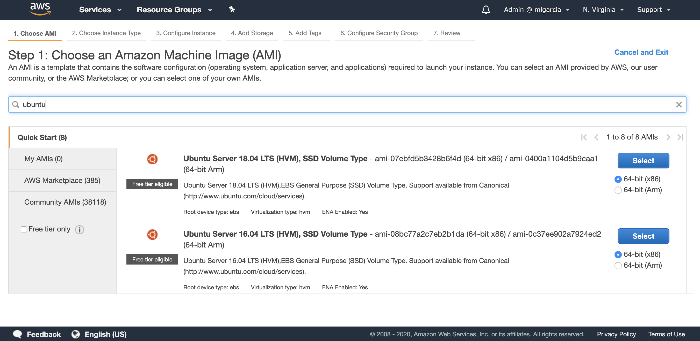
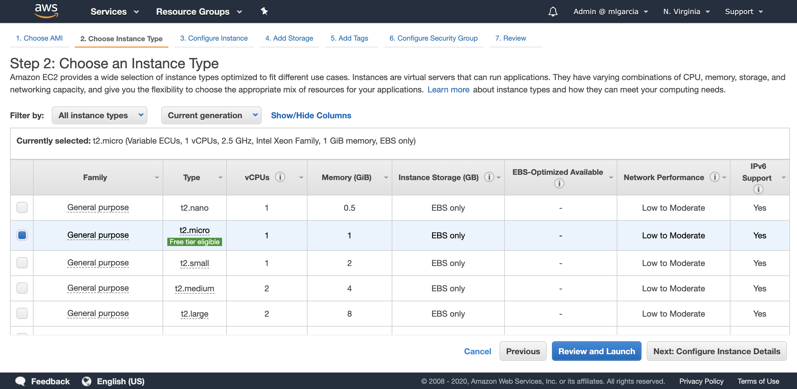
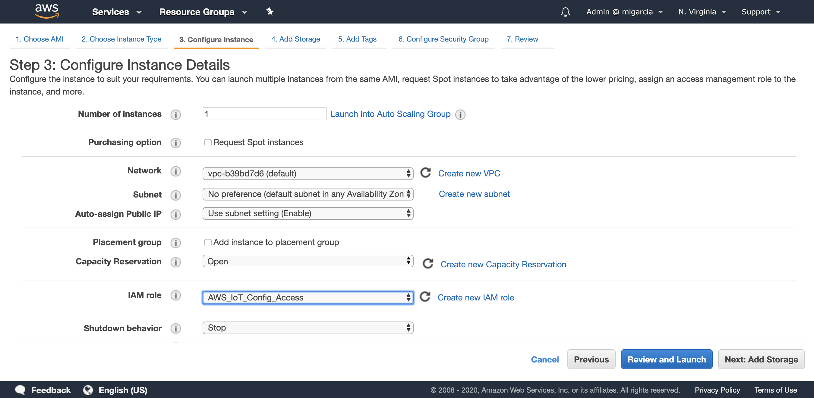
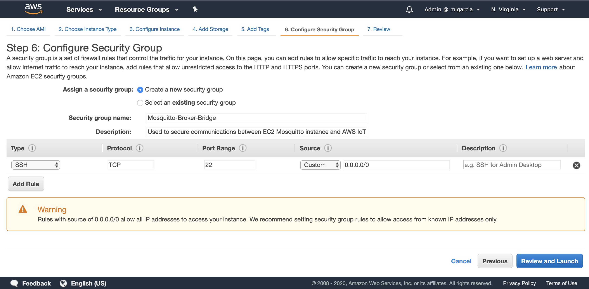

# Cloud Synchronization
## Contents
1. [Introduction](#1-Introduction)
2. [Launching and Configuring EC2 Instance](#2-Launching-and-Configuring-EC2-Instance)
3. [Installing MQTT Broker on AWS](#3-Installing-MQTT-Broker-on-AWS)
4. [Configurations for MQTT broker](#4-Configurations-for-MQTT)
5. [Run CloudSync](#5-Run-Cloudsync)
6. [DataStructures Used](#6-DataStructures)

# 1. Introduction
This module would be responsible for sending the data (can be sensor data or any reading or image/video data, etc.) collected from different devices in the home environment to a cloud Endpoint (AWS). This Sync to the cloud will be using a API Call by the service application. The broker used is mosquitto which is setup at AWS endpoint. The Service Application will make a POST API call which will then check first for the connection to the broker and then establish a connection if not present to further publish the data to the cloud. After successful publish or in case of failure corresponding response is sent back to the service application<br><br>


### MQTT Example
Consider a Home Scenario where a thermostat sends its temperature update to Broker on topic home/temperature. Two other devices have subscribed to same topic say home/temperature. So The subscribed clients can get update everytime the thermostat publishes data on the topic


# 2. Launching and Configuring EC2 Instance

**This chapter is an example of setting up an AWS EC2 instance for ease of understanding. See Official AWS instructions.**

### A. Create a Role for IOT Access
1. Go to the AWS Web Console and click create a Role
 
2. Select EC2 and click on Next: Permissions 

3. Filter with the value AWSIoTConfigAccess. Then select the policy AWSIoTConfigAccess and click on Next: Tags. Skip the next screen by clicking on Next: Review.

4. Enter AWS_IoT_Config_Access as the Role name and enter a Role description. Review the role and click on Create role

5. Now that the Role has been created you can go to Amazon EC2.

### B. Creating EC2 Instance with role created

1. Choose a region, in this article I am using N. Virginia (us-east-1). Then click on Launch Instance and use the filter with the value “ubuntu”. Select the Ubuntu Server 18.04 LTS x86 

2. Select the t2.micro instance type 

3. Click on Next: Configure Instance Details. In the IAM Role dropdown, select AWS_IoT_Config_Access
Make sure you use the default VPC and that the Auto-assign Public IP is Enable to get a public IP automatically. If you wish to use another VPC, make sure the subnet you choose will enable you to remotely connect to your Amazon EC2 instance. Then, click on Next: Add Storage.

4. Leave everything as is and click on Next: Tag Instance. You may assign a tag to your instance. Click on Next: Configure Security Groups. Create a new security group as described in the screenshot

5. Review and launch the EC2 instance. Make sure to select an existing Key Pair or to create a new one in order to connect to the Amazon EC2 instance later on. Once the Amazon EC2 instance is running, click on “Connect” and follow instructions to establish a connection through a terminal.


# 3. Installing MQTT Broker on AWS

Once logged into the Amazon EC2 instance type the following commands:
#Update the list of repositories with one containing the latest version of #Mosquitto and update the package lists
```
sudo apt-add-repository ppa:mosquitto-dev/mosquitto-ppa
sudo apt-get update

```
#Install the Mosquitto broker, Mosquitto clients 
```
sudo apt-get install mosquitto
sudo apt-get install mosquitto-clients
```

# 4. Configurations for MQTT broker
The Edge-Orchestration can be run in two modes: normal and secure, therefore the MQTT broker can be run in the following configurations `/etc/mosquitto/mosquitto.conf`

**Normal** (No security, port 1883)
```
# Place your local configuration in /etc/mosquitto/conf.d/
#
# A full description of the configuration file is at
# /usr/share/doc/mosquitto/examples/mosquitto.conf.example

persistence true
persistence_location /var/lib/mosquitto/

log_dest file /var/log/mosquitto/mosquitto.log

include_dir /etc/mosquitto/conf.d

listener 1883:0.0.0.0
allow_anonymous true
```

**Secure** (With TLS certificates, port 8883)
```
# Place your local configuration in /etc/mosquitto/conf.d/
#
# A full description of the configuration file is at
# /usr/share/doc/mosquitto/examples/mosquitto.conf.example

persistence true
persistence_location /var/lib/mosquitto/

log_dest file /var/log/mosquitto/mosquitto.log

include_dir /etc/mosquitto/conf.d

listener 8883:0.0.0.0
allow_anonymous false

cafile /etc/mosquitto/certs/ca-crt.pem
certfile /etc/mosquitto/certs/hen-crt.pem
keyfile /etc/mosquitto/certs/hen-key.pem

require_certificate true
use_identity_as_username true
```

> How to generate `cafile`, `certfile` and  `keyfile` is described [here](https://github.com/lf-edge/edge-home-orchestration-go/blob/master/docs/secure_manager.md#53-generation-key-infrastructure)

# 5. Run Cloudsync 

**Normal mode**
The edge-orchestration is build and run using following command with option CLOUD_SYNC set to true
```sh
docker run -it -d --privileged --network="host" --name edge-orchestration -e CLOUD_SYNC=true -v /var/edge-orchestration/:/var/edge-orchestration/:rw -v /var/run/docker.sock:/var/run/docker.sock:rw -v /proc/:/process/:ro  lfedge/edge-home-orchestration-go:latest
```
From the another terminal/post make a curl command as follows to publish data using home edge to the broker running on AWS endpoint

```sh
curl --location --request POST 'http://<ip where edge-orchestration is running>:56001/api/v1/orchestration/cloudsyncmgr/publish' \
--header 'Content-Type: text/plain' \
--data-raw '{
    "appid": "<appid of service app>",
    "payload": "{Another data from TV1 and testdata}",
    "topic": "home1/livingroom",
    "url" : "<AWS public IP>"
}'
```
**Secure mode**
The edge-orchestration is build and run using following command with option `CLOUD_SYNC` and `SECURE` set to true
```sh
docker run -it -d --privileged --network="host" --name edge-orchestration -e CLOUD_SYNC=true -e SECURE=true -v /var/edge-orchestration/:/var/edge-orchestration/:rw -v /var/run/docker.sock:/var/run/docker.sock:rw -v /proc/:/process/:ro  lfedge/edge-home-orchestration-go:latest
```
From another terminal/post, it is recommended to make a curl command as follows to publish data using home edge to the broker running on AWS endpoint<br>
***Please Note :***  Donot use '/' in topic name field.

```sh
curl --location --request POST 'http://<ip where edge-orchestration is running>:56001/api/v1/orchestration/cloudsyncmgr/publish' \
-H "Authorization: $EDGE_ORCHESTRATION_TOKEN" \
--header 'Content-Type: text/plain' \
--data-raw '{
    "appid": "<appid of service app>",
    "payload": "{Another data from TV1 and testdata}",
    "topic": "home1-livingroom",
    "url" : "<AWS public IP>"
}'
```
From another terminal/post,it is recommended to make a curl post command as follows to subscribe to topic using home edge to the broker running on AWS endpoint

```sh
curl --location --request POST 'http://<ip where edge-orchestration is running>:56001/api/v1/orchestration/cloudsyncmgr/subscribe' \
--header 'Content-Type: text/plain' \
--data-raw '{
    "appid": "<appid of the service app>",
    "topic": "kitchen1",
    "url" : "<AWS public IP>"
}'
```
From another terminal/post,it is recommended make a curl get command as follows to get the data received on subscribed topic by passing the clientid(appid) and topic in the request header

```sh
curl --location --request GET 'http://<ip where edge-orchestration is running>:56001/api/v1/orchestration/cloudsyncmgr/getsubscribedata/<topicname>/<appid>'
```
# 6. DataStructures Used
### a. URLData 
This is a hashmap of the type <string,[]string> to store the client ids (appids) mapped to the Url of the broker to which the client are connected. For any first time entry of url in the hashmap, a connection is established between the broker and Home Edge. For any subsequent entry for the same url, the client id is appended to the list of client ids and same connection object is used for communication. In case of any client calling disconnect or wants to terminate the connection with broker, the client id can be removed from the list of client ids. In case of one single client for any url calling the disconnect or wanting to terminate the connection, then the connection with the broker is closed and url entry with its key is removed from the Hashmap.
### b. MQTTClient
This hashmap of type<string,*Client> stores the client object for every new url connection between home edge and Broker.When a request for any url comes to Home Edge , this hashmap is searched to see if the client object exits. If the client object exist, the object is returned and further operations of publish/subscribe is performed. Incase if the client object is not present for the given url, then entry to MQTTClient hashmap is created with the url and object created. When all the clients for any url have closed the connection, entry from MQTTClient for that url is also removed.
### c. SubscriptionInfo
This hashmap of type<{topic,url},[]clientid> stores the subscriptionInfo. The key used here is composite and uses both topic and url to uniquely identify the subscription. Multiple clients can subscribe to the same broker on same topic and so the list of such clientids is stored as value.Before retrieving the data requested by any client, this hashmap will be checked to see if the client is subscribed or not.
### d. SubscribedData
This hashmap of type<{topic,url},string> stores the data published by any client on topic that has been subscribed by any client for the same broker.When a client requests for subscription to any topic, a entry is made to this hashmap with {topic,url} as the composite key and the latest published data as the string.Whenever a new data for the same key is published, the entry is updated. At any given point, this hashmap contains the latest value published for the topic on the broker url mentioned.