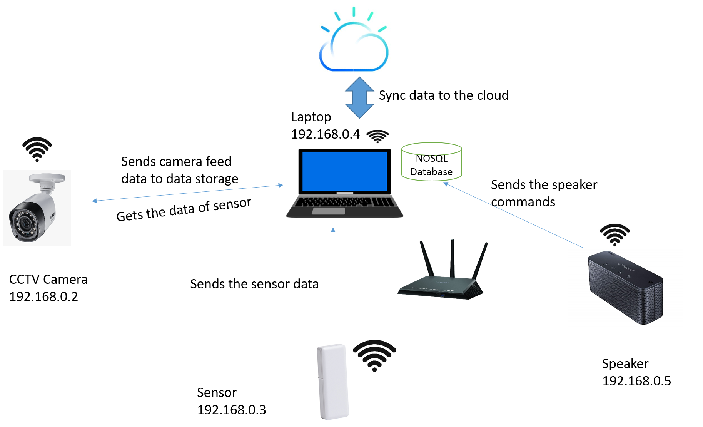

# Data Storage
## Contents
1. [Introduction](#1-introduction)
2. [System Description](#2-system-description)
3. [Limitations and Assumptions](#3-limitations-and-assumptions)
4. [How to Run](#4-how-to-run)  
    4.1 [Configuration](#41-configuration)  
    4.2 [Run EdgeX Foundry Containers](#42-run-edgex-foundry-containers)  
    4.3 [Run Edge Orchestration](#43-run-edge-orchestration)

## 1. Introduction
This module to be developed would be responsible for storing the data (can be sensor data or any reading or image/video data, etc.) from different devices in the home environment. Any device registered to this module can also request for data to different device. The databases used to store the data is Redis DB/Mongo DB (as a choice from a user, with repect to its parent EdgeX recommendation). At regular intervals this data would also be synced up with the cloud to remove the data from the device and free the device space for new incoming data.

## 2. System Description
**Centralized data storage architecture**: A centralized database is stored at a single location such as high computing power device in the home. It is maintained and modified from that location only and usually accessed using REST APIs by the devices connected by LAN/WAN. The centralized database collects the data can be used to train the model and also provide data to the different devices when needed.



The laptop acts as the centralized storage. All the devices are connected to each other using Wi-Fi. Camera sends the data to the database using the REST API. Similarly other devices also send their data to the central storage. Devices can also ask for data of other devices like camera ask for sensor data. For this the devices needs to call the API using the camera device id. At regular intervals the data stored are also synced with the cloud infrastructure and thereby deleted from the data controller.

The devices would be categorized into categories like the devices which send the data frequently for example CCTV camera and devices which send data less frequently for example thermostat devices. The time interval at which the data will be send to the data controller will be decided upon the frequency nature of the device to send the readings. For example, in the devices which send data frequently, the interval can be in seconds say 20s, while for the other category it can be set to 1 minute. Also the device capacity to store the data in the database locally is also considered while deciding this interval.

Similarly while sending the data if the data controller is offline or not available, then the data is stored locally at the device and it would try again after every 1 min for 10 minutes to check if the data controller has come online. Once the locally stored data is synced with the data controller, device deletes the data and frees its local space.

After syncing to the cloud the data is deleted from the data controller. In the cases where a device queries for data which is not available in the data controller, in such scenario the data controller will respond with 404 error or with the URL of the cloud where the data is synced to the cloud.

## 3. Limitations and Assumptions
The current development assumes the data storage module to have one single Data Storage in a home, Centralized Storage Architecture. All the devices will register to the Data Storage's metadata and provide their info. Then the devices can send the data to data controller or also query the data controller for a data specific to a device or time interval.

The following architecture assumes that data stored at data controller would be uploaded to the cloud at some scheduled intervals to free up the space at the device level. Hence the Data Storage device will be dependent on the cloud connectivity at those intervals.

## 4. How to Run

### 4.1 Configuration

- Placement the [`test/container/datastorage/`](../test/container/datastorage/) folder into `/var/edge-orchestration/apps/` in your **Home Edge** with Data Storage (**Device A**).
```sh
sudo cp -rf test/container/datastorage/ /var/edge-orchestration/apps/
```

### 4.2 Run EdgeX Foundry containers
- Run the Hanoi version of EdgeX Docker containers on your Linux machine (**Device A**) with respect to the guidance from [EdgeX Foundry Services](https://github.com/edgexfoundry/edgex-go#get-started), or the _simplest way_ that you can follow using follows;

```sh
cd deployments/datastorage
docker-compose up -d
```

### 4.3 Run Edge Orchestration
- Run `edge-home-orchestration-go` with DataStorage on **Device A**, referring to "How to work" in [link](./platforms/x86_64_linux/x86_64_linux.md#how-to-work).
- You can see the **Device A** has the `DataStorage` service as follows:
```
docker logs -f edge-orchestration
```
```
INFO[2021-08-10T04:28:20Z]discovery.go:572 func1 [deviceDetectionRoutine] edge-orchestration-c1b23cc6-0767-400a-9cf0-36e1b3902da2
INFO[2021-08-10T04:28:20Z]discovery.go:573 func1 [deviceDetectionRoutine] confInfo    : ExecType(container), Platform(docker)
INFO[2021-08-10T04:28:20Z]discovery.go:574 func1 [deviceDetectionRoutine] netInfo     : IPv4([10.113.70.227]), RTT(0)
INFO[2021-08-10T04:28:20Z]discovery.go:575 func1 [deviceDetectionRoutine] serviceInfo : Services([DataStorage])
```
- Other devices running with **Home Edge** will connect automatically.
