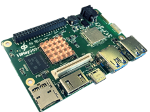

# Edge Orchestration on HiKey960
[](https://www.96boards.org/documentation/consumer/hikey/hikey960/getting-started/)

## Preparing Hikey960 board

The HiKey960 supports the following operating systems:
1. AOSP
2. Ubuntu 16.04.5
3. Debian

We will install **Debian** (currently only Debian supports the necessary components for docker).

#### 1. Installation Debian on HiKey960
Instructions on how to install debian can be found [here](https://wiki.debian.org/InstallingDebianOn/96Boards/HiKey960).
We used Installation onto the UFS storage.
>  It should be noted that links to files required for installation are often not correct, so we provide them here:
[UEFI](https://snapshots.linaro.org/reference-platform/components/uefi-staging/108/hikey960/release/)
[Boot & Rootfs](http://snapshots.linaro.org/96boards/hikey/linaro/debian/48/)

#### 2. Start HiKey960

After starting Linux, you need to run the `nmtui` to configure the Wi-Fi.

> login/password - linaro/linaro

Everything is now ready to deploy Edge-Orchestration

---

## Quick start
This section provides how to download and run pre-built Docker image without building the project.

#### 1. Install docker

- docker

```sh
curl -sSL https://get.docker.com | sh
sudo usermod -aG docker $USER
newgrp docker
```

#### 2. Download Docker image from [Docker Hub](https://hub.docker.com/r/lfedge/edge-home-orchestration-go/tags)

To download the image, you must execute the command: `docker pull lfedge/edge-home-orchestration-go:{tag}`, where `{tag}` is a release name.
```shell
docker pull lfedge/edge-home-orchestration-go:latest
```
If it succeeds, you can see the Docker image as follows:
```shell
docker images

REPOSITORY                            TAG           IMAGE ID            CREATED             SIZE
lfedge/edge-home-orchestration-go     latest        740bcf622152        6 hours ago         161MB
```

#### 3. Run with Docker image

How to run see [here](../x86_64_linux/x86_64_linux.md#how-to-work).

---

## How to build Edge-Orchestration

Prerequisites: install the docker and qemu packages

- Docker
```sh
curl -sSL https://get.docker.com | sh
sudo usermod -aG docker $USER
newgrp docker
```
- Qemu packages

```shell
sudo apt-get install qemu binfmt-support qemu-user-static
```

Run the `make create_context` and specify the configuration file name `arm64c` and `make`, see example below:
```
make distclean ; make create_context CONFIGFILE=arm64c ; make
```

> To change the configuration file, you must execute the command `make distclean`

The build result will be `edge-orchestration.tar` archive that can be found `bin/edge-orchestration.tar`

Next, need to copy `edge-orchestration.tar` archive to the HiKey960 board and load the image using the command:
```shell
docker load -i edge-orchestration.tar
```
The build is finished, how to run see [here](../x86_64_linux/x86_64_linux.md#How-to-work).

---

## References
https://www.96boards.org/product/hikey960/  
https://www.96boards.org/documentation/consumer/hikey/hikey960/installation/board-recovery.md.html  
https://wiki.debian.org/InstallingDebianOn/96Boards/HiKey960  
https://developer.arm.com/solutions/machine-learning-on-arm/developer-material/how-to-guides/running-and-profiling-arm-nn-on-the-hikey-960  
http://www.lemaker.org/product-hikeysecond-resource.html  
