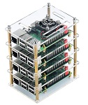

# Edge Orchestration on Raspberry Pi 3 Cluster

[](https://www.raspberrypi.org/products/raspberry-pi-3-model-b-plus/)

## Preparing Raspberry Pi 3 board

### Minimum H/W requirements
  * Raspberry Pi3: 2 pcs
  * Power Cable: 2 pcs micro USB
  * Ethernet Cable: 1 pcs (but you can use wireless)
  * Micro SD Card: 2 pcs 16 Gb

### Recommended H/W requirements
  * Raspberry Pi3: 4 pcs
  * Power Cable: 4 Short micro USB 
  * Multiport USB Charging HUB: 1 pcs
  * Ethernet Switch: 1 pcs
  * Ethernet Cable: Short 4 pcs (but you can use wireless)
  * Micro SD Card: 32 Gb
  * Cluster Case: 1 pcs


#### 1. Download image and writing Raspbian OS on a SD card
To install the Raspbian OS follow the [instructions](https://www.raspberrypi.org/documentation/installation/installing-images/README.md).

#### 2. Start Raspberry Pi 3

Insert the SD card into the Raspberry Pi 3 and turn on the power. Make configuration settings for the Raspbian the first time you turn it on.
And you should [enable ssh](https://www.raspberrypi.org/documentation/remote-access/ssh/).

> The steps described above need to be done with each Raspberry Pi 3 boards.

---

## Quick start
This section provides how to download and run pre-built Docker image without building the project.

> TBD

---

## How to build
There are two options for building a edge-orchestration container:
1. [On your PC and downloading the edge-orchestration container image](../raspberry_pi3/raspberry_pi3.md#1-using-your-pc) from the `edge-orchestration.tar` archive (recommended).
2. [Build directly on the Raspberry Pi 3 board](../raspberry_pi3/raspberry_pi3.md#2-build-directly-on-the-Raspberry-Pi-3-board).


**After the end of the build, we strongly recommend using the tools to run commands on multiple Raspberry Pi 3 boards.** 

---

## How to run 

### Tools to run commands on multiple Raspberry Pi 3 boards.

We hope that you already have SSH setup to access all your Raspberry Pi 3s and secondly, when accessing multiple Raspberry Pi 3 boards simultaneously, it is appropriate to [set up key-based password-less SSH](https://www.raspberrypi.org/documentation/remote-access/ssh/passwordless.md) on all of your Raspberry Pi 3 boards.

#### PSSH – Parallel SSH (Recommended)

1. Install pssh on your PC
```
sudo apt-get install pssh
```
2. Setting the ip addresses of your Raspberry Pi 3 boards.

Enter the hostnames or IP addresses of remote boards with SSH Port in a file called `hosts`.

Example `hosts` file:
```
pi@192.168.0.104:22
pi@192.168.0.110:22
pi@192.168.0.111:22
pi@192.168.0.112:22
```
3. Command execution on all boards:   
Format that we use: `$ parallel-ssh -i -h hosts "<your command>"`

Example:
```
parallel-ssh -i -h hosts "date"
```
```
[1] 16:47:47 [SUCCESS] pi@192.168.0.111:22
Fri 12 Feb 2021 04:47:48 PM EET
[2] 16:47:47 [SUCCESS] pi@192.168.0.110:22
Fri 12 Feb 2021 04:47:48 PM EET
[3] 16:47:47 [SUCCESS] pi@192.168.0.112:22
Fri 12 Feb 2021 04:47:48 PM EET
[4] 16:47:47 [SUCCESS] pi@192.168.0.104:22
Fri 12 Feb 2021 04:47:48 PM EET
```

#### Pdsh – Parallel Remote Shell Utility
> Very similar to the utility described above

#### [Fabric](http://www.fabfile.org/index.html) (w/o using RSA-keys)
1. Install fabric on your PC
```
sudo apt-get install fabric
```

2. Setting the ip addresses of your Raspberry Pi 3 boards.

Example `fabfile.py` file:
```
from fabric.api import *

env.hosts = [
        'pi@192.168.0.104',
        'pi@192.168.0.110',
        'pi@192.168.0.111',
        'pi@192.168.0.112',
]

env.password = 'raspberry'

@parallel

def cmd(command):
    sudo(command)

```

3. Command execution on all boards:   
Format that we use: `$ fab cmd:"<your command>"`

Example:
```
fab cmd:"date"
```
```
[pi@192.168.0.104] Executing task 'cmd'
[pi@192.168.0.110] Executing task 'cmd'
[pi@192.168.0.111] Executing task 'cmd'
[pi@192.168.0.112] Executing task 'cmd'
[pi@192.168.0.112] sudo: date
[pi@192.168.0.111] sudo: date
[pi@192.168.0.110] sudo: date
[pi@192.168.0.104] sudo: date
[pi@192.168.0.104] out: 
[pi@192.168.0.104] out: SSH is enabled and the default password for the 'pi' user has not been changed.
[pi@192.168.0.104] out: This is a security risk - please login as the 'pi' user and type 'passwd' to set a new password.
[pi@192.168.0.104] out: 
[pi@192.168.0.110] out: 
[pi@192.168.0.110] out: SSH is enabled and the default password for the 'pi' user has not been changed.
[pi@192.168.0.110] out: This is a security risk - please login as the 'pi' user and type 'passwd' to set a new password.
[pi@192.168.0.110] out: 
[pi@192.168.0.104] out: Fri 12 Feb 2021 05:09:20 PM EET
[pi@192.168.0.104] out: 
[pi@192.168.0.111] out: 
[pi@192.168.0.111] out: SSH is enabled and the default password for the 'pi' user has not been changed.
[pi@192.168.0.111] out: This is a security risk - please login as the 'pi' user and type 'passwd' to set a new password.
[pi@192.168.0.111] out: 

[pi@192.168.0.110] out: Fri 12 Feb 2021 05:09:20 PM EET
[pi@192.168.0.110] out: 

[pi@192.168.0.111] out: Fri 12 Feb 2021 05:09:20 PM EET
[pi@192.168.0.112] out: 
[pi@192.168.0.111] out: 
[pi@192.168.0.112] out: SSH is enabled and the default password for the 'pi' user has not been changed.
[pi@192.168.0.112] out: This is a security risk - please login as the 'pi' user and type 'passwd' to set a new password.
[pi@192.168.0.112] out: 

[pi@192.168.0.112] out: Fri 12 Feb 2021 05:09:20 PM EET
[pi@192.168.0.112] out: 

Done.
```

#### Shell script (w/o using RSA-keys)
An example of an initial script:
```
#!/bin/bash
# Hosts
hostarray=(
        "pi@192.168.0.104"
        "pi@192.168.0.110"
        "pi@192.168.0.111"
        "pi@192.168.0.112"
        )

for i in "${hostarray[@]}"; do
    sshpass -p "raspberry"  ssh "$i" "$@"
done
```
> Suggest your options for improvement or utilities that can be used.

**Now you can start running the `edge-orchestration` saving time and effort** 

---

### Copy `edge-orchestration.tar`, set up and run edge-orchestration. 

Next, need to copy `edge-orchestration.tar` archive to the Paspberry Pi 3 boards
```
scp edge-orchestration.tar pi@192.168.0.104:.
```

Install the docker container (see [here](../raspberry_pi3/raspberry_pi3.md#Build-Prerequisites) only docker part) and load the image using the command:
```shell
parallel-ssh -i -h hosts "docker load -i edge-orchestration.tar"
```

How to run see [here](../x86_64_linux/x86_64_linux.md#how-to-work).
