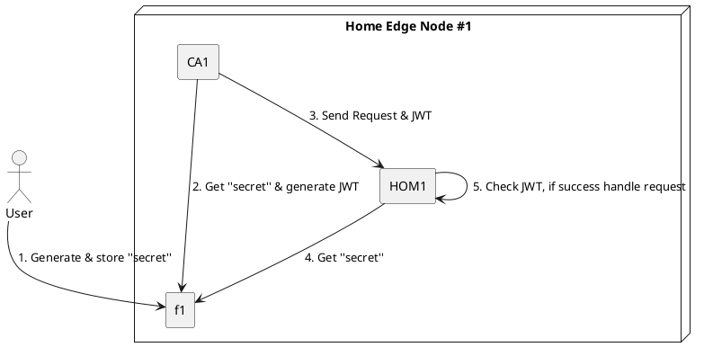

# Secure Manager
## Contents
1. [Introduction](#1-introduction)
2. [Verifier](#2-verifier)  
    2.1 [Description](#21-description)  
    2.2 [Workflow](#22-workflow)  
    2.3 [Verifier Management](#23-verifier-management)  
    2.4 [Usage Edge-Orchestration with Verifier](#24-usage-edge-orchestration-with-verifier)  
3. [Authenticator](#3-authenticator)  
    3.1 [Description](#31-description)  
    3.2 [Workflow](#32-workflow)  
    3.3 [JWT generation](#33-jwt-generation)  
    3.4 [JWT usage](#34-jwt-usage)  
4. [Authorizer](#4-authorizer)  
    4.1 [Description](#41-description)  
    4.2 [Workflow](#42-workflow)  
    4.3 [JWT generation with user’s name for authorization](#43-jwt-generation-with-users-name-for-authorization)  


## 1. Introduction
The **Secure Manager** is designed to control security components. Currently it is in an initial state of development and includes the following components:
  1. Verifier  
  2. Authenticator
  3. Authorizer (RBAC)
 
In order for the Secure Manager to be allowed, it is necessary to assemble the **Edge-Orchestration** with the `secure` option.

---

## 2. Verifier
### 2.1 Description
The verifier ensures that only allowed containers (images) are launched; a list of allowed containers (their sha256 hashes) is stored in a `/var/edge-orchestration/data/cwl/containerwhitelist.txt` file.

### 2.2 Workflow
 > TBD
---
 
### 2.3 Verifier Management
There are two ways to change the container white list:
1. Using REST API
2. Editing the `containerwhitelist.txt` file (root rights required)

#### 2.3.1 REST API
 REST API supports the next functions for contaner white list management:
 * _**addHashCWL**_ - adds container image hash to the container white list
 * _**delHashCWL**_ - deletes container image hash from the container white list
 * _**delAllHashCWL**_ - deletes all container image hashes from container white list
 * _**printAllHashCWL**_ - displays all hashes (from the container white list) in the log.

> **To send commands it is necessary to use a JSON Web Token (see [3. Authenticator](#3-authenticator))**.

Examples of using these commands are given below:
 - POST  
 - **IP:56001/api/v1/orchestration/securemgr** 
 - BODY (depends on the command): 
 
_**addHashCWL**_  
JSON:
```json
    {
        "SecureMgr": "Verifier",
        "CmdType": "addHashCWL",
        "Desc": [
        {
            "ContainerHash": "fc6a51919cfeb2e6763f62b6d9e8815acbf7cd2e476ea353743570610737b752"
        },
        {
            "ContainerHash": "fc6a51919cfeb2e6763f62b6d9e8815acbf7cd2e476ea353743570610737b751"
        }],
        "StatusCallbackURI": "http://localhost:8888/api/v1/services/notification"
    }
```
Curl:
```shell
curl -X POST "127.0.0.1:56001/api/v1/orchestration/securemgr" -H "accept: application/json" -H "Content-Type: application/json" -H "Authorization: $EDGE_ORCHESTRATION_TOKEN" -d "{ \"SecureMgr\": \"Verifier\", \"CmdType\": \"addHashCWL\", \"Desc\": [{ \"ContainerHash\": \"fc6a51919cfeb2e6763f62b6d9e8815acbf7cd2e476ea353743570610737b752\"}, { \"ContainerHash\": \"fc6a51919cfeb2e6763f62b6d9e8815acbf7cd2e476ea353743570610737b751\"}], \"StatusCallbackURI\": \"http://localhost:8888/api/v1/services/notification\"}"
```

_**delHashCWL**_  
JSON:
```json
    {
        "SecureMgr": "Verifier",
        "CmdType": "delHashCWL",
        "Desc": [
        {
            "ContainerHash": "fc6a51919cfeb2e6763f62b6d9e8815acbf7cd2e476ea353743570610737b752"
        }],
        "StatusCallbackURI": "http://localhost:8888/api/v1/services/notification"
    }
```
Curl:
```shell
curl -X POST "127.0.0.1:56001/api/v1/orchestration/securemgr" -H "accept: application/json" -H "Content-Type: application/json" -H "Authorization: $EDGE_ORCHESTRATION_TOKEN" -d "{ \"SecureMgr\": \"Verifier\", \"CmdType\": \"delHashCWL\", \"Desc\": [{ \"ContainerHash\": \"fc6a51919cfeb2e6763f62b6d9e8815acbf7cd2e476ea353743570610737b752\"}], \"StatusCallbackURI\": \"http://localhost:8888/api/v1/services/notification\"}"
```
_**delAllHashCWL**_  
JSON:
```json
    {
        "SecureMgr": "Verifier",
        "CmdType": "delAllHashCWL",
        "StatusCallbackURI": "http://localhost:8888/api/v1/services/notification"
    }
```
Curl:
```shell
curl -X POST "127.0.0.1:56001/api/v1/orchestration/securemgr" -H "accept: application/json" -H "Content-Type: application/json" -H "Authorization: $EDGE_ORCHESTRATION_TOKEN" -d "{ \"SecureMgr\": \"Verifier\", \"CmdType\": \"delAllHashCWL\", \"StatusCallbackURI\": \"http://localhost:8888/api/v1/services/notification\"}"
```
_**printAllHashCWL**_  
JSON:
```json
    {
        "SecureMgr": "Verifier",
        "CmdType": "printAllHashCWL",
        "StatusCallbackURI": "http://localhost:8888/api/v1/services/notification"
    }
```
Curl:
```shell
curl -X POST "127.0.0.1:56001/api/v1/orchestration/securemgr" -H "accept: application/json" -H "Content-Type: application/json" -H "Authorization: $EDGE_ORCHESTRATION_TOKEN" -d "{ \"SecureMgr\": \"Verifier\", \"CmdType\": \"printAllHashCWL\", \"StatusCallbackURI\": \"http://localhost:8888/api/v1/services/notification\"}"
```

#### 2.3.2 Editing the container white list by other tools.
  
The `/var/edge-orchestration/data/cwl/containerwhitelist.txt` file consists of records that include: container's image sha256 hash (64-ASCII symbols) + '\n'
Therefore, it can be edited with any editor or from the command line.
Example: _how to add hash by command line_
```shell
# echo "fc6a51919cfeb2e6763f62b6d9e8815acbf7cd2e476ea353743570610737b752" >> /var/edge-orchestration/data/cwl/containerwhitelist.txt
```
---

### 2.4 Usage Edge-Orchestration with Verifier
To run **Edge Orchestration** container you need to add a digest (sha256) to the last parameter. For example:  `"hello-world@sha256:fc6a51919cfeb2e6763f62b6d9e8815acbf7cd2e476ea353743570610737b752"`
```
$ curl -X POST "IP:56001/api/v1/orchestration/services" -H "accept: application/json" -H "Content-Type: application/json" -H "Authorization: $EDGE_ORCHESTRATION_TOKEN" -d "{ \"ServiceName\": \"hello-world\", \"ServiceInfo\": [{ \"ExecutionType\": \"container\", \"ExecCmd\": [ \"docker\", \"run\", \"-v\", \"/var/run:/var/run:rw\", \"hello-world@sha256:fc6a51919cfeb2e6763f62b6d9e8815acbf7cd2e476ea353743570610737b752\"]}], \"StatusCallbackURI\": \"http://localhost:8888/api/v1/services/notification\"}"
```  
If the `"fc6a51919cfeb2e6763f62b6d9e8815acbf7cd2e476ea353743570610737b752"` hash is written to the `/var/edge-orchestration/data/cwl/containerwhitelist.txt` file, the container will be launched successfully.

---

## 3. Authenticator
### 3.1 Description
The **Authenticator** provides access to resources only for authenticated users (services). The current implementation is based on the use of [JSON Web Tokens](https://tools.ietf.org/html/rfc7519) (JWT). The Authenticator uses the `HMAC` or `RSA256` algorithms to generate the JWTs. The key phrase (secret) is stored in `/var/edge-orchestration/data/jwt/passPhraseJWT.txt` file for HMAC and the pubkey is stored in `/var/edge-orchestration/data/jwt/app_rsa.pub` for RSA256.
> The distribution of the key phrase is not yet in the field of implementation and should be done manually (especially considering the fact that external REST API requests can only be from the `localhost` or `127.0.0.1`).
---

### 3.2 Workflow
 > To view the Workflow, you need to install a `plantuml` extension for your browser.
 
 


---

### 3.3 JWT generation

To create a JWT, you can use the script [tools/jwt_gen.sh](../tools/jwt_gen.sh) by running it as shown below:
For `HMAC`
```shell
$ . tools/jwt_gen.sh HS256 Admin
```
or for `RSA256`
```shell
$ . tools/jwt_gen.sh RS256 Admin
```

The generated token is exported to the shell environment variable: `EDGE_ORCHESTRATION_TOKEN`.
Enter the following command to display the token:
```shell
$ echo $EDGE_ORCHESTRATION_TOKEN
```

> If you want to use the `RSA256` algorithm, you need to generate keys using the commands:
```
$ cd /var/edge-orchestration/data/jwt
$ openssl genrsa -out app_rsa.key keysize
$ openssl rsa -in app_rsa.key -pubout > app_rsa.pub
```

---
### 3.4 JWT usage
To use a JWT, you must include it in the header of the request: `Authorization: {token}`.
Example below:
```shell
$ curl -X POST "127.0.0.1:56001/api/v1/orchestration/securemgr" -H "accept: applicationnt-Type: application/json" -H "Authorization: $EDGE_ORCHESTRATION_TOKEN" -d "{ \"SecureMgr\": \"Verifier\", \"CmdType\": \"printAllHashCWL\", \"StatusCallbackURI\": \"http://localhost:8888/api/v1/services/notification\"}"
```
---

## 4. Authorizer (RBAC)
### 4.1 Description
The **Authorizer** provides *Role Based Access Control (RBAC)*. Its an approach to restricting system access to authorized users by using a set of permissions and grants. In Edge-Orchestration project was used the open-source access control library [*casbin*](https://github.com/casbin/casbin). "In Casbin, an access control model is abstracted into a CONF file based on the PERM metamodel (Policy, Effect, Request, Matchers). So switching or upgrading the authorization mechanism for a project is just as simple as modifying a configuration" ([description from the official site](https://github.com/casbin/casbin#How-it-works?)). 
The system is currently configured in the simplest configuration with two roles: `admin` and `member`. The table below demonstrates access to external api for these roles.
| Resource\Role                   | admin | member |
| ------------------------------- | ----- | ------ |
| /api/v1/orchestration/services  | Allow | Allow  |
| /api/v1/orchestration/securemgr | Allow | Deny   |

To change the access model and policy, you need to edit the files:  
`/var/edge-orchestration/data/rbac/auth_model.conf`
```
[request_definition]
r = sub, obj, act

[policy_definition]
p = sub, obj, act

[policy_effect]
e = some(where (p.eft == allow))

[matchers]
m = r.sub == p.sub && keyMatch(r.obj, p.obj) && (r.act == p.act || p.act == "*")

```

and `/var/edge-orchestration/data/rbac/policy.csv`
```
p, admin, /*, *
p, member, /api/v1/orchestration/services, *
```
---

### 4.2 Workflow
> To view the Workflow, you need to install a `plantuml` extension for your browser.
 
> TBD 
 
---

### 4.3 JWT generation with user's name for authorization

To create a JWT, you can use the script [tools/jwt_gen.sh](../tools/jwt_gen.sh) by running it as shown below:
common rules
```shell
$ . tools/jwt_gen.sh [Algo] [User]
```
where: Algo {}; User {Admin, Member}.
Examples:
For `HMAC` and `Admin`
```shell
$ . tools/jwt_gen.sh HS256 Admin
```
or for `RSA256` and `Member`
```shell
$ . tools/jwt_gen.sh RS256 Member
```
> It should be noted that the user's `name` and `role` are currently hardcoded in [authorizer.go](../internal/controller/securemgr/authorizer/authorizer.go),
 but this will change when the ability to register users in the system is added.  
```
users = append(users, User{Name: "Admin", Role: "admin"})
users = append(users, User{Name: "Member", Role: "member"})
```

---
